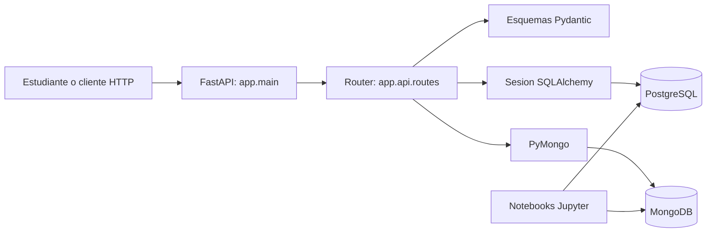

# Arquitectura

## Estilo

La solucion es un **monolito modular**: una aplicacion FastAPI, un proceso de API y una unidad de despliegue, organizada internamente por responsabilidades. PostgreSQL y MongoDB son almacenes externos, no microservicios de la aplicacion.

## Responsabilidades

- `app/main.py`: crea la aplicacion y registra el router.
- `app/api/routes.py`: define operaciones HTTP y coordina persistencia.
- `app/schemas/`: valida entradas y define respuestas publicas.
- `app/models/`: define entidades relacionales del ORM.
- `app/db/`: centraliza sesiones SQL y acceso a la coleccion Mongo.
- `app/core/config.py`: carga configuracion del entorno.

## Flujo de una solicitud

1. FastAPI recibe JSON y Pydantic valida tipos y limites.
2. El router coordina la operacion en el motor que corresponde al recurso.
3. SQLAlchemy usa una sesion por solicitud para cursos/estudiantes; PyMongo escribe documentos para observaciones.
4. La respuesta se valida y serializa con el esquema de salida.

## Decisiones de persistencia

- **PostgreSQL:** datos con estructura estable, relaciones, unicidad y reglas de integridad. Cursos y estudiantes son entidades relacionadas.
- **MongoDB:** observaciones cuyo contenido y etiquetas pueden cambiar o crecer con el ejercicio. Cada observacion se conserva como documento.
- No se replica automaticamente un registro entre motores. `course_id` en una observacion es una referencia informativa; la integridad de esa referencia no la garantiza MongoDB.
- Las transacciones distribuidas entre ambos motores no forman parte del ejemplo. Si un caso requiere consistencia fuerte cruzada, se debe redisenar el limite de datos.

## Ejecucion local

Docker Compose levanta PostgreSQL y MongoDB. FastAPI se ejecuta localmente con Uvicorn para que el estudiante pueda inspeccionar el codigo y depurarlo desde VS Code. Los notebooks pueden conectarse a los mismos puertos locales si se amplian con clientes de base de datos.